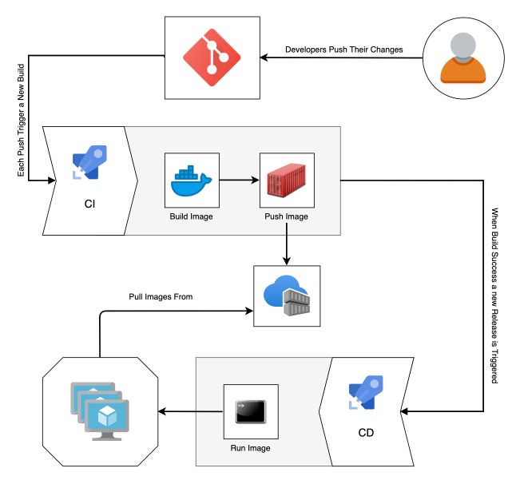
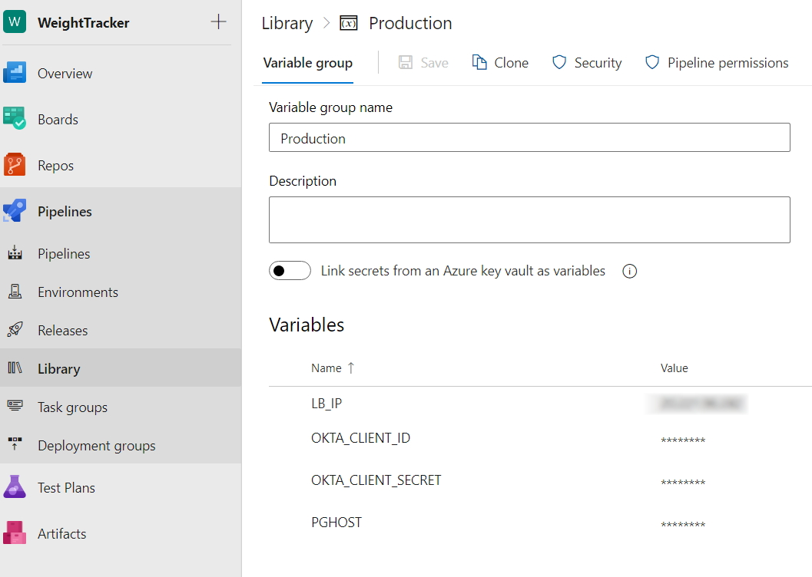

# CI/CD (yaml) of the Weight Tracker app 
|   |    |   |
| ----------- | ----------- |  ----------- |

**Notes:**
This env is running with Docker containers. The Docker is created with the Docker file  in this repo and can be tested on local env using:
 ```
 docker-compose -f docker-compose.yaml up
 ```
## Configuration
1. Create a new pipeline using the clone of this repository (GitHub). Select an existing YAML file: azure-pipelines.yml.
2. Create 2 Environments (For the deployment stages). Select Linux machine and install on the Ansible VM using the installation guide on the screen. This machine is both the Ansible (so it will run the playbook for all VMs) and the deployment client (the Ansible will be called as part of the CD).
3. Set the production environment to be approval required.
4. Set the Library Variable groups (one for Production and one for Staging). Set the group permission to be available to the pipeline.
  * Use the values from the Terraform / Azure machines to enter the values for each variable as shown below. Note to set them as secrets.
     
4. Create an Agent pool in the project settings. In this yaml file, it is referenced as 'my-pool'.
5. After building the app, Docker image is pushed to ACR (Azure Container Registry) - on master branch only. For feature branch, image is not pushed.
6. On each commit to the Repository, the CI will automatically run and the CD is pending your approval.
7. To pull the image from ACR, Create the service principal to enable connection to ACR:
https://docs.microsoft.com/en-us/azure/container-registry/container-registry-auth-service-principal#create-a-service-principal
8. You can view the Ansible setup [here](https://github.com/ItaiGafny/Sela-Week7-Ansible).

**Requirements:**
* [Azure DevOps account](https://dev.azure.com/)
* Azure DevOps project
* Microsoft Azure account
